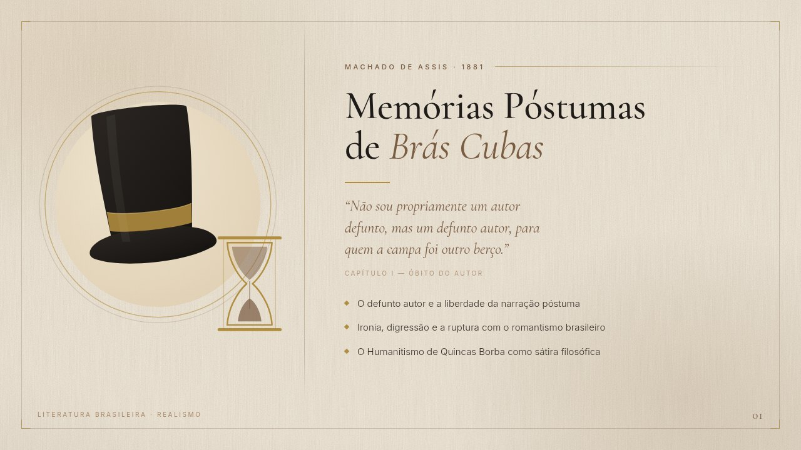

# Memórias Póstumas de Brás Cubas — modelo de slide 16:9

Modelo de slide editorial (16:9) sobre o romance de Machado de Assis, feito em
HTML + SVG — vetorial, editável e exportável em qualquer resolução.



## Conceito

- **Fundo**: papel bege/off-white com textura de fibra e grão gerada por filtros
  SVG (`feTurbulence`) — sem imagem raster, sem dependência externa.
- **Esquerda**: ilustração flat, minimalista — silhueta de cartola do século XIX
  com um contorno de ampulheta ao lado, sobre disco sépia e anéis dourados
  (o tema do *defunto autor* e do tempo).
- **Direita**: área limpa reservada para título e tópicos.
- **Paleta**: preto carvão `#1E1B18`, marrom sépia `#7A5C42`, dourado `#B08D3F`,
  papel `#F3EDE1`.
- **Tipografia**: Cormorant Garamond (títulos e citação) + Inter (apoio),
  ambas SIL OFL, com os subsets latinos embarcados em `fonts/`.

## Arquivos

| Arquivo | O que é |
|---|---|
| `slide.html` | o modelo em si — palco lógico de 1280×720 |
| `fonts.css` + `fonts/` | subsets latinos das fontes (uso offline) |
| `exportar.js` | exporta o HTML em PNG/JPG via Chrome headless (CDP) |
| `export/…-exemplo.pdf` | PDF de 1 página, 13,333 × 7,5 pol (16:9 widescreen), texto vetorial |
| `export/…-fundo.pdf` | idem, lado direito vazio |
| `export/…-exemplo-3840.jpg` | 3840×2160 (4K), com o texto de exemplo |
| `export/…-fundo-3840.jpg` | 3840×2160 (4K), lado direito vazio — o arquivo para usar como fundo |
| `export/papel-1920.jpg` | textura de papel já rasterizada, usada só na impressão |
| `export/previa-1280.jpg` | 1280×720, só para a prévia deste README |

## PDF

`export/bras-cubas-16x9-exemplo.pdf` e `…-fundo.pdf` têm **uma página de
13,333 × 7,5 pol** — exatamente o tamanho de slide 16:9 widescreen do PowerPoint
e do Google Slides, então importam sem borda nem redimensionamento. O texto
continua vetorial (dá para selecionar e copiar).

Um detalhe do caminho: os filtros `feTurbulence` da textura travam o
`printToPDF` do Chrome. Por isso o `exportar.js` primeiro assa a textura em
`export/papel-1920.jpg` (modo `?papel=1`) e o CSS de `@media print` usa esse JPG
no lugar dos filtros. O papel vira imagem; todo o resto segue vetor.

## Três modos

Abra `slide.html` no navegador:

- `slide.html` — com o texto de exemplo preenchido
- `slide.html?vazio=1` — esconde o texto e mostra a caixa-guia tracejada
- `slide.html?limpo=1` — esconde tudo do lado direito (é o que gera o `fundo`)
- `slide.html?papel=1` — só as camadas de fundo (usado para assar a textura)

## Como editar

- **Cores**: variáveis em `:root`, no topo do `<style>`.
- **Textos**: bloco `<div class="texto">` — sobrelinha, `<h1>`, citação, tópicos.
- **Número do slide / rodapé**: bloco `<div class="rodape">`.
- **Ilustração**: o `<svg>` dentro de `<div class="arte">`. A cartola é um grupo
  (`copa` + `aba` + fita); a ampulheta é um grupo separado, posicionado por
  `transform="translate(…) scale(…)"`.

## Como reexportar

```bash
node exportar.js          # gera os arquivos em export/
CHROME_BIN=/caminho/para/chrome node exportar.js
```

Para PNG sem perda ou outros tamanhos, edite a lista `jobs` no topo de
`exportar.js` (`scale` 1.5 → 1920×1080; `format: 'png'` em vez de `jpeg`).

O palco é sempre 1280×720 lógicos; o `deviceScaleFactor` define a resolução de
saída (1.5 → 1920×1080, 3 → 3840×2160). Como o layout é vetorial, dá para pedir
qualquer escala sem perda.

## Para usar no PowerPoint / Google Slides / Canva

Use `export/bras-cubas-16x9-fundo-3840.jpg` como **imagem de fundo** do slide e
digite por cima, no lado direito. Margem segura sugerida: a partir de ~42% da
largura, com 56 px de respiro (na escala de 1280 px).

## Citação usada no exemplo

> "Não sou propriamente um autor defunto, mas um defunto autor, para quem a
> campa foi outro berço."
> — *Memórias Póstumas de Brás Cubas*, capítulo I ("Óbito do autor")

Texto conferido contra a edição de 1881 no Wikisource (grafia modernizada).
O romance saiu primeiro em folhetim na *Revista Brasileira* (1880) e em livro
em 1881 — a sobrelinha do slide usa 1881.

---

Esta pasta é um material avulso — não faz parte do site da loja. `slide.html`
leva `<meta name="robots" content="noindex">` para não aparecer em busca.
